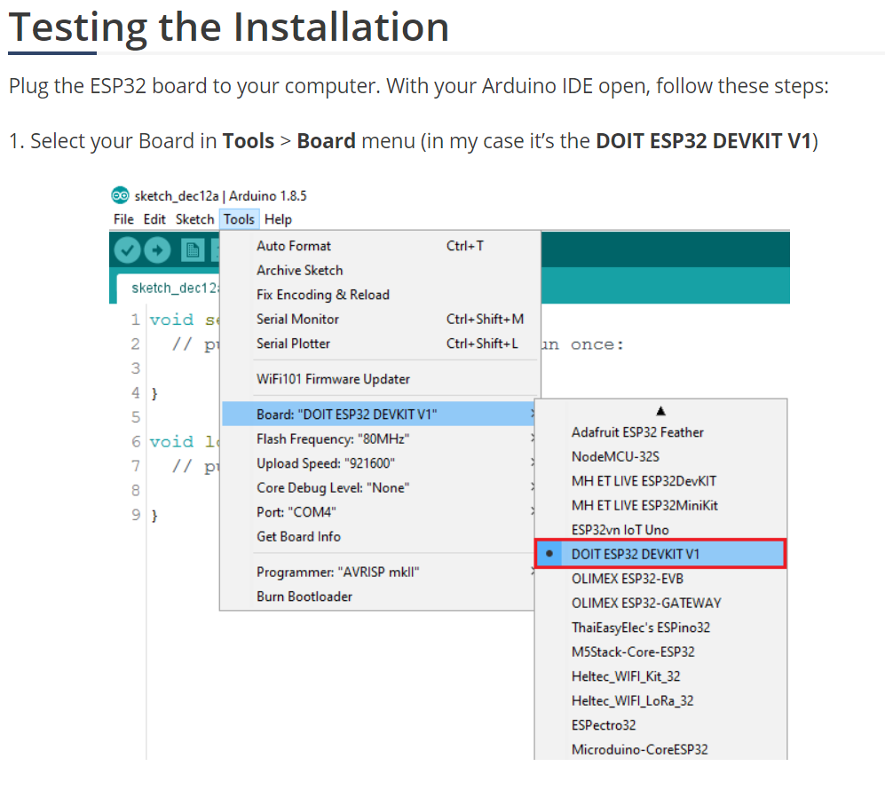
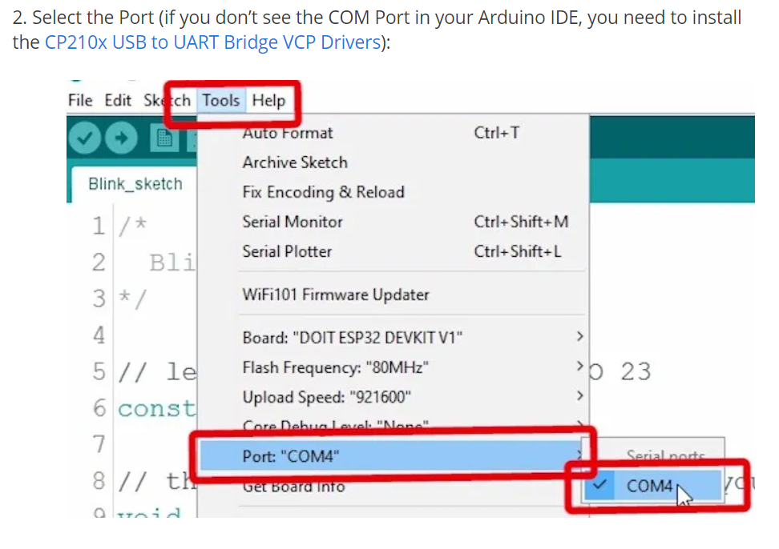
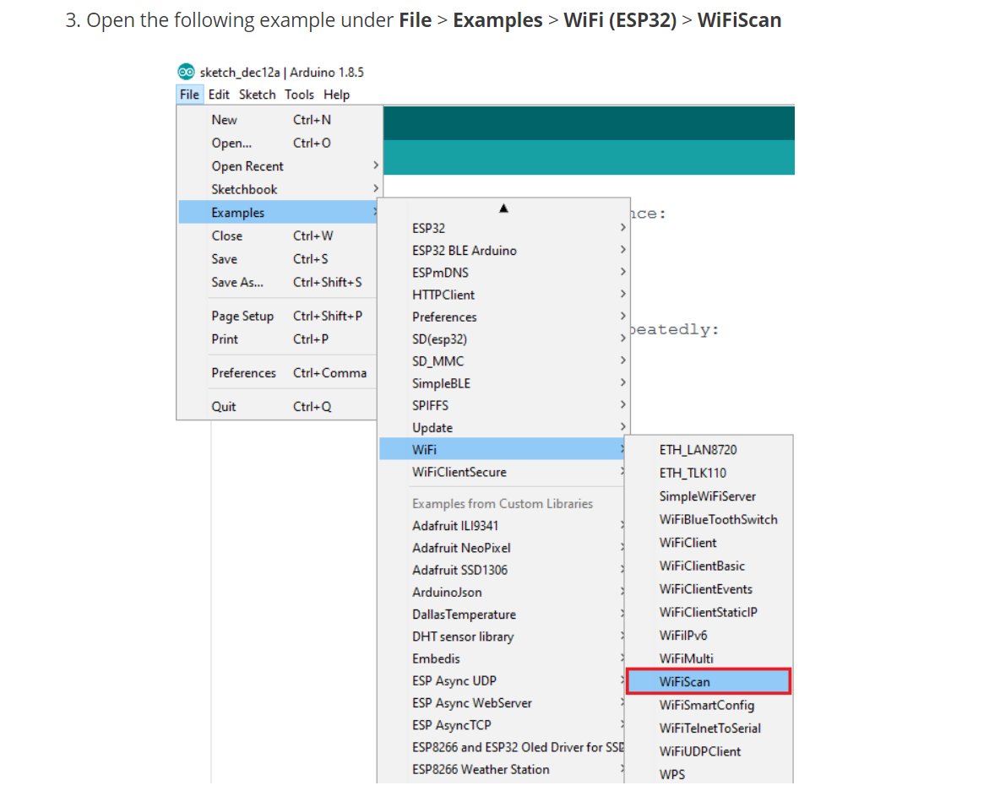
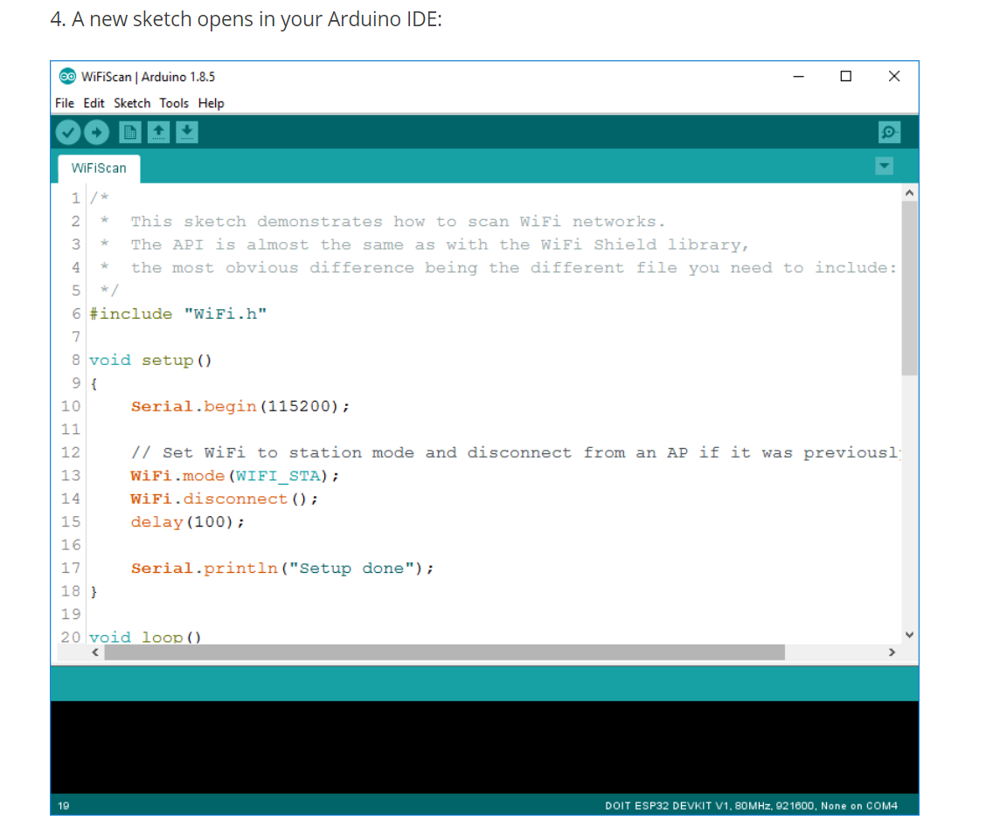
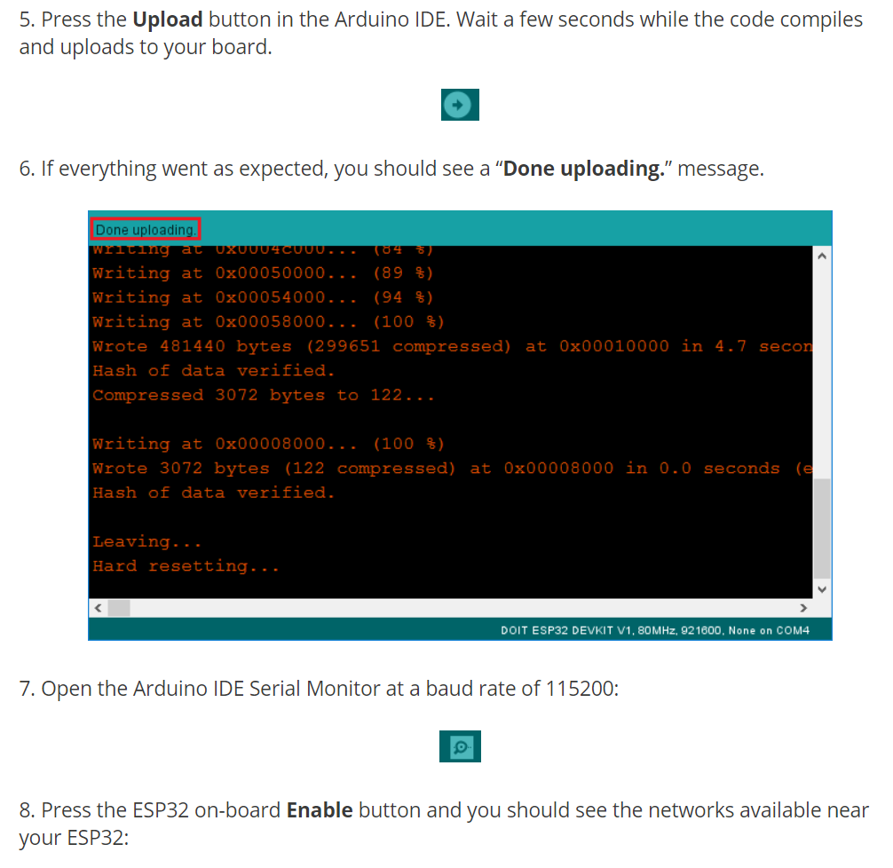
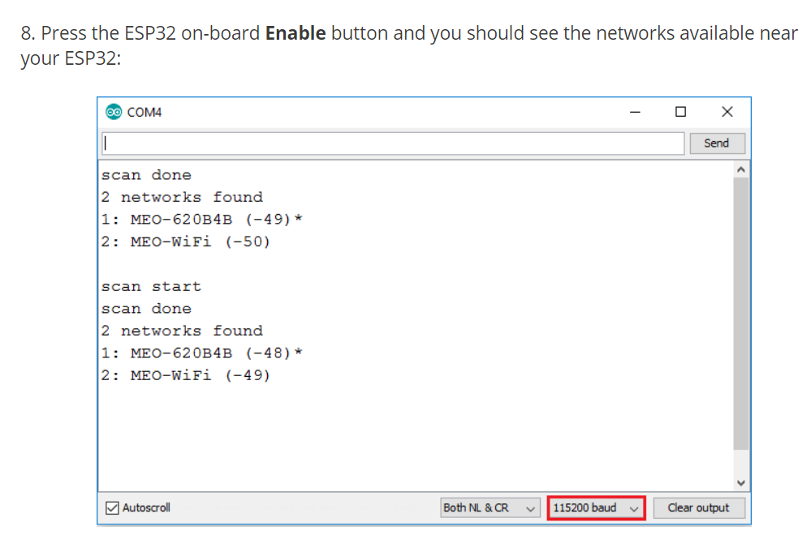
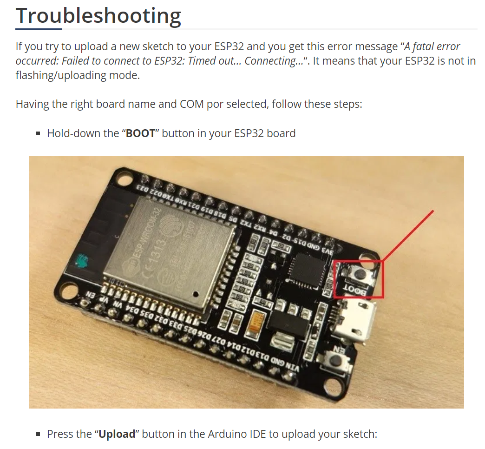
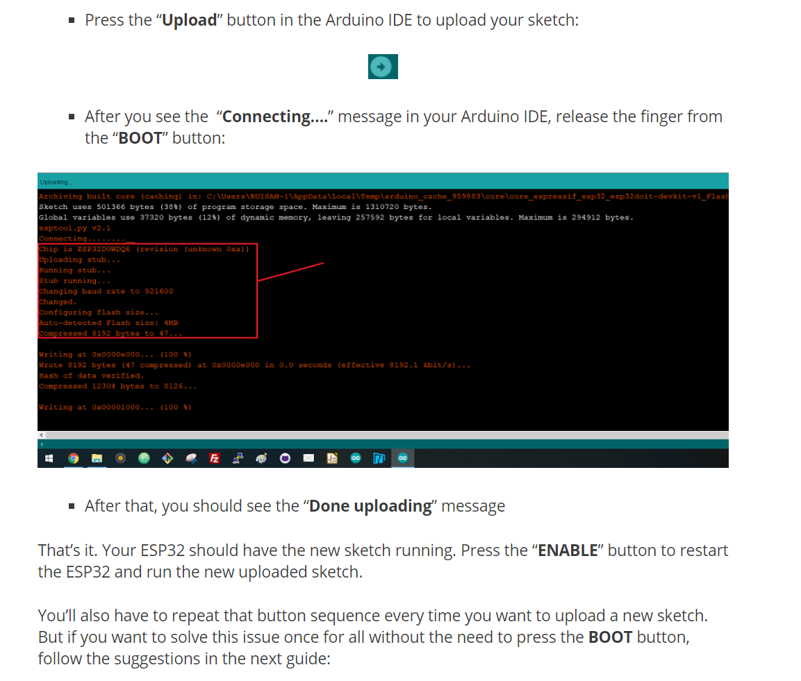
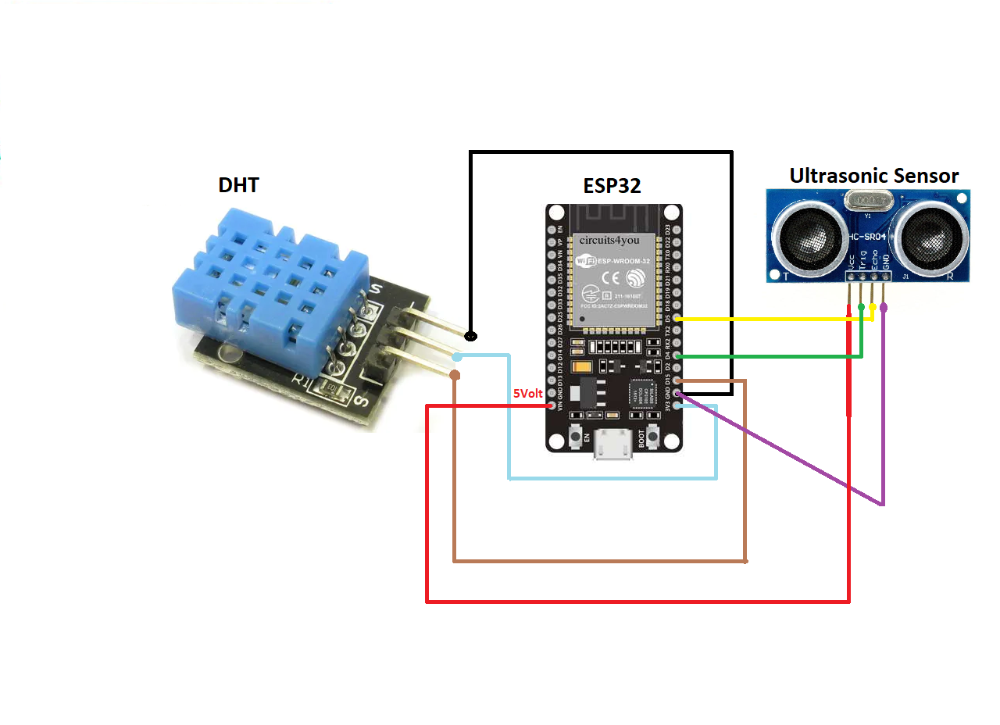

ESP32-Weather_Station

# Installing the ESP32 Board in Arduino IDE

# Testing The Installation Instruction

# TroubleShooting Instruction

# ESP32-Weather-Station-And-UltraSonic-Complete-Diagram

